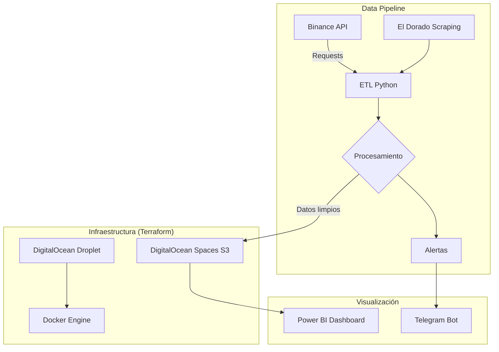

# Crypto Arbitrage Tracker  
*Autor: Gabriela Rodríguez*  

## 🚀 Overview  
Sistema automatizado para detectar oportunidades de arbitraje en criptomonedas entre Binance P2P y mercados locales como El Dorado. Implementa **Infraestructura como Código (IaC)** con Terraform para un despliegue reproducible en DigitalOcean.  

## 📊 Features  
- **Extracción de datos:** Web scraping/APIs (Binance, El Dorado) con manejo de errores  
- **Cálculo de spreads:** Pandas + Python con validación de datos  
- **Dashboard interactivo:** Power BI con visualización de tendencias históricas  
- **Automatización E2E:**  
  - CI/CD con Jenkins
  - Orchestration con Terraform  
  - Scheduling con Cron

## 🛠️ Tech Stack  

| Área           | Tecnologías                                                                 |  
|----------------|-----------------------------------------------------------------------------|  
| **Backend**    | Python (Pandas, Flask), APIs REST, Type Hints                               |  
| **Data Pipe**  | Cron, Validación de datos con Pydantic                            |  
| **Cloud**      | DigitalOcean (Droplet + Spaces S3), Docker, Terraform (IaC)                |  
| **DevOps**     | Jenkins (CI/CD auto-alojado), Grafana + Prometheus (monitoreo)|  
| **Viz**        | Power BI (+ Power Automate), Alertas en Telegram/Email                      |  

## 📈 Arquitectura

## Estructura de carpetas hibrida ( monolito - microservicio )

/arbitrage_tracker
│
├── /apps                          # Cada "app" será un futuro microservicio
│   │
│   ├── /binance_adapter           # Podría ser un container aparte luego
│   │   ├── handler.py             # Lógica específica de Binance
│   │   ├── db_models.py   
|   |   ├── schemas.py              # Pydantic (valida estructura)
|   |   └── tests/
|   |       ├── unit/
|   |       │   ├── test_schemas.py     # Tests de validación pura
|   |       │   ├── test_handler.py     # Tests de lógica (mocks)
|   |       │   └── test_db_models.py   # Tests de DB (con fixtures)
|   |       └── integration/
|   |           ├── test_flow.py        # Test del flujo completo
|   |           └── conftest.py         # Configuración compartida
|   |
│   ├── /eldorado_adapter          # Otro posible microservicio
│   │   ├── scraper.py             # Scraping específico
│   │   └── utils.py               # Funciones auxiliares
│   │
│   ├── /arbitrage_engine          # Núcleo del cálculo
│   │   ├── calculator.py          # Lógica de spreads
│   │   └── thresholds.py          # Reglas de oportunidades
│   │
│   └── /notification_service      # Alertas
│       ├── notifier.py            # Envío a Telegram/Email
│       └── templates/             # Plantillas de mensajes
│
├── /core                          # Funcionalidad compartida
│   ├── storage.py                 # Conexión a DO Spaces
│   └── logging.py                 # Configuración centralizada
│
├── /config                        # Configuración global
│   ├── settings.py                # Variables de entorno (Pydantic)
│   └── deploy/                    # Scripts para Docker/K8s (futuro)
│
└── main.py                        # Orquestación (punto de entrada)